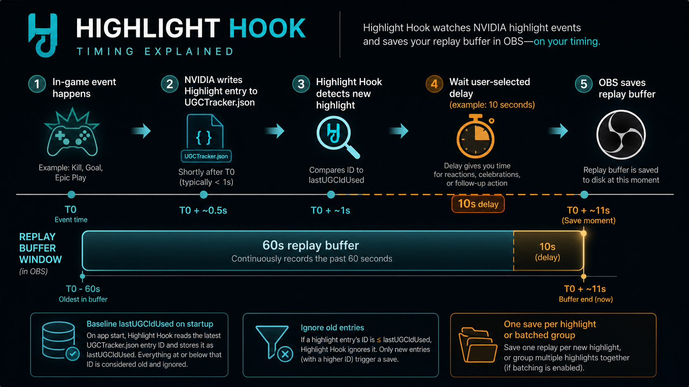
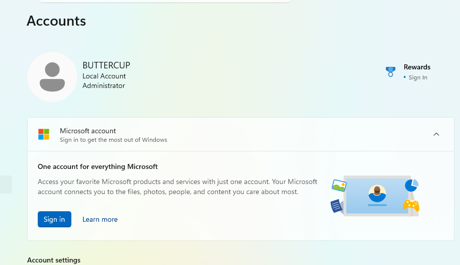

# Highlight Hook

Highlight Hook watches NVIDIA's local `UGCTracker.json` file and tells OBS Studio to save the replay buffer after a user-selected delay.

The goal is simple: keep the automatic NVIDIA highlight trigger, but save a longer OBS clip that includes the reaction after the event.

## How It Works

1. On startup, the app loads the last known highlight ID from NVIDIA's tracker file.
2. It watches `UGCTracker.json` for new highlight entries.
3. When a new valid highlight appears, it waits the configured delay.
4. After the delay, it sends `SaveReplayBuffer` to OBS WebSocket.

## Timing

The graphic below shows the basic flow:



## Screenshot

Current app screenshot:



## Settings

- `Highlight tracker path`: the NVIDIA `UGCTracker.json` file
- `After-highlight reaction delay`: how long to wait before saving in OBS
- `Replay buffer length`: how much time OBS keeps in memory
- `OBS host`, `OBS port`, `OBS password`: WebSocket connection settings

## Notes

- The app is not limited to Fortnite.
- It works with games that write NVIDIA Highlights into the same local tracker format.
- Replay buffer length is entered manually because OBS does not expose that value over WebSocket.

## Build

```powershell
cd HighlightHook
dotnet build
```

## Run

```powershell
cd HighlightHook
dotnet run
```
